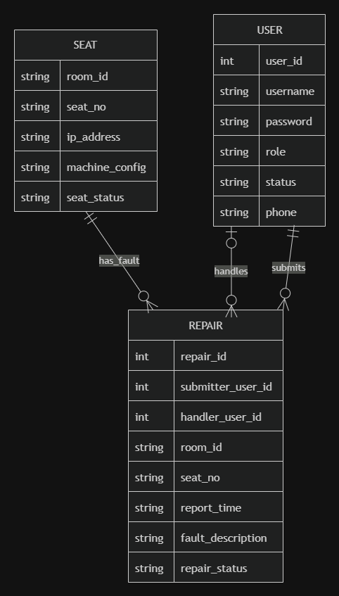

# 高校机房管理系统设计

## 项目基本信息

* **课程名称**：数据库原理与应用
* **课程设计题目**：高校机房管理系统
* **系统类型**：数据库应用系统 / 信息管理系统
* **适用场景**：高校公共机房、教学实验机房、专业实验室

## 项目说明

本项目面向高校机房管理场景，设计并实现一个以机位资源调度、课堂上机考勤、设备报修维护为核心的机房管理系统。

本系统采用无计费设计，不包含充值、扣费、账单流水等功能。系统重点解决以下问题：

1. 学生无法实时了解机房空闲机位情况；
2. 教学机房排课与学生自由上机可能产生冲突；
3. 课堂考勤依赖人工点名，效率较低；
4. 设备故障反馈不及时，故障机位容易被继续分配；
5. 管理员难以及时掌握机房、机位、课程安排和上机记录。

系统通过统一用户账号、学生、教师、管理员、机房、机位、课程、排课、上机记录和设备报修等信息的统一管理，实现高校机房资源的数字化管理。

---

# 一、需求分析阶段

## 1.1 系统目标

本系统旨在建立一个面向高校机房的数据库管理系统，实现机房资源、教学排课、学生上机、课堂考勤和设备维护等信息的统一管理。

系统主要目标如下：

1. **提高机位资源利用率**
   实时记录并展示机房和机位的使用状态，减少学生盲目寻找机位的情况。

2. **规范学生上机管理**
   记录学生上机时间、下机时间、使用机位、上机类型等信息，形成可查询的上机历史。

3. **支持课堂自动考勤**
   将排课信息与学生登录上机行为结合，在上课时间段内自动生成考勤记录。

4. **降低设备维护成本**
   学生或教师发现设备故障后可提交报修，系统将故障机位标记为不可用，管理员处理后恢复状态。

5. **支持查询与统计**
   为学生、教师和管理员提供不同权限下的信息查询和统计功能。

6. **统一用户身份管理**
   通过统一的 User 用户账号实体管理学生、教师和管理员的登录账号、密码、角色和账号状态，避免不同角色账号信息重复设计。

## 1.2 系统边界

本系统主要面向高校免费公共机房或实验教学机房，设计边界如下：

1. 本系统不包含计费功能，不处理充值、扣费、余额、账单流水等数据；
2. 本系统不直接对接真实教务系统，课程和排课数据由管理员录入；
3. 本系统不实现真实电脑远程控制，仅记录和维护机位状态；
4. 本系统重点关注数据库设计与管理功能，不以复杂前端界面为主要目标；
5. 本系统主要服务于学生上机、教师考勤、管理员维护三个业务场景；
6. 本系统使用统一用户表保存登录账号信息，学生、教师和管理员分别作为不同角色的扩展信息。

## 1.3 用户角色分析

系统用户主要分为学生、教师和管理员三类。三类用户都需要通过统一的用户账号登录系统，系统再根据用户角色分配对应权限。

### 1.3.1 学生

学生是系统中主要的上机用户，主要需求如下：

1. 登录系统；
2. 查询机房开放状态和空闲机位数量；
3. 在自由上机时间段登录并使用机位；
4. 在课堂时间段登录指定机房完成上课签到；
5. 查询个人上机历史记录；
6. 查询个人课堂考勤记录；
7. 对故障设备提交报修申请。

### 1.3.2 教师

教师主要负责查看课程安排和课堂考勤情况，主要需求如下：

1. 登录系统；
2. 查看本人课程安排；
3. 查看某节课学生上机签到情况；
4. 查询迟到、早退、缺勤学生名单；
5. 导出或查看班级考勤统计结果；
6. 查看机房当前机位使用情况；
7. 对异常使用情况进行记录或反馈；
8. 对发现的设备故障提交报修申请。

### 1.3.3 管理员

管理员负责系统基础数据维护和业务数据管理，主要需求如下：

1. 维护学生、教师、班级、课程等基础信息；
2. 维护机房和机位信息；
3. 维护系统用户账号和角色信息；
4. 录入、修改和删除课程排课信息；
5. 检查排课时间和机房占用冲突；
6. 查看学生上机记录；
7. 查看机房使用率统计；
8. 处理设备报修申请；
9. 将故障机位恢复为可用状态。

## 1.4 功能需求分析

根据用户角色和业务场景，系统划分为以下功能模块。

### 1.4.1 用户与权限管理模块

该模块用于管理不同角色用户的登录和权限。

主要功能包括：

1. 学生、教师、管理员通过统一用户账号登录；
2. 系统根据 User 表中的角色字段区分学生、教师和管理员；
3. 根据用户角色分配不同操作权限；
4. 管理员维护用户账号、账号状态和角色信息；
5. 管理员维护学生、教师、班级等基础信息；
6. 支持用户密码和基本信息维护。

### 1.4.2 机房与机位管理模块

该模块用于管理机房资源和机位状态。

主要功能包括：

1. 管理员录入机房信息；
2. 管理员维护每个机房中的机位信息；
3. 系统记录机位状态，包括空闲、自习中、上课中、故障；
4. 学生和教师可以查询机房空闲机位数量；
5. 故障机位不能被系统分配。

### 1.4.3 上下机管理模块

该模块用于记录学生上机和下机行为。

主要功能包括：

1. 学生登录后选择或由系统分配空闲机位；
2. 系统生成上机记录，记录上机时间、机房、机位和学生信息；
3. 学生下机后，系统记录下机时间；
4. 系统释放机位，将机位状态恢复为空闲；
5. 系统区分自由上机和课堂上机两种上机类型。

### 1.4.4 排课与考勤管理模块

该模块是本系统的核心业务模块，用于管理教学排课和课堂考勤。

主要功能包括：

1. 管理员录入课程、教师、班级、机房和上课时间；
2. 系统检查同一机房在同一时间段是否存在排课冲突；
3. 学生在上课时间段登录对应机房时，系统自动生成课堂考勤记录；
4. 系统根据登录时间判断学生考勤状态；
5. 教师可以查看某节课的考勤结果；
6. 教师可以统计班级到课率、迟到人数、缺勤人数等信息。

### 1.4.5 设备报修与维护模块

该模块用于记录设备故障和维修处理情况。

主要功能包括：

1. 学生或教师发现设备故障后提交报修信息；
2. 系统通过统一用户编号记录报修提交者；
3. 系统记录故障机房、故障机位、故障描述和报修时间；
4. 系统将对应机位状态设置为故障；
5. 故障机位不再参与机位分配；
6. 管理员处理维修申请，系统记录处理管理员；
7. 维修完成后，管理员将机位状态恢复为空闲。

## 1.5 主要业务流程

### 1.5.1 学生自由上机流程

```text
学生登录系统
    ↓
系统根据 User 表确认学生身份
    ↓
系统判断机房是否开放
    ↓
学生查询或选择空闲机位
    ↓
系统检查机位是否可用
    ↓
系统生成上机记录
    ↓
机位状态变更为“自习中”
    ↓
学生下机
    ↓
系统记录下机时间并释放机位
```

### 1.5.2 课堂上机考勤流程

```text
学生登录系统
    ↓
系统根据 User 表确认学生身份
    ↓
系统判断当前时间是否属于排课时间段
    ↓
系统判断学生是否属于该课程对应班级
    ↓
允许学生登录对应机房
    ↓
系统生成课堂上机记录
    ↓
根据登录时间判断正常、迟到或缺勤
    ↓
教师查看课堂考勤结果
```

### 1.5.3 管理员排课流程

```text
管理员登录系统
    ↓
系统根据 User 表确认管理员身份
    ↓
管理员录入课程、教师、班级、机房、时间段
    ↓
系统检查该机房同一时间段是否已被占用
    ↓
若无冲突，则保存排课记录
    ↓
若存在冲突，则提示管理员重新选择时间或机房
```

### 1.5.4 设备报修流程

```text
学生或教师登录系统
    ↓
系统根据 User 表确认报修人身份
    ↓
学生或教师提交报修申请
    ↓
系统记录报修人、故障描述、报修时间和报修机位
    ↓
系统将机位状态设置为“故障”
    ↓
管理员查看并处理报修申请
    ↓
系统记录处理管理员
    ↓
维修完成后更新维修状态
    ↓
系统将机位状态恢复为“空闲”
```

## 1.6 数据需求分析

系统需要管理的数据包括：

| 数据类别 | 主要数据项 |
|---|---|
| 用户账号信息 | 用户编号、登录账号、登录密码、用户角色、账号状态、联系电话 |
| 学生信息 | 学号、用户编号、姓名、性别、年级、所属班级 |
| 班级信息 | 班级编号、班级名称、所属专业、总人数 |
| 教师信息 | 教师工号、用户编号、姓名、职称 |
| 管理员信息 | 管理员编号、用户编号、姓名 |
| 课程信息 | 课程号、课程名称、总学时、课程性质 |
| 机房信息 | 机房号、机房位置、总座数、开放状态 |
| 机位信息 | 机房号、机位号、IP 地址、机器配置、机位状态 |
| 排课信息 | 排课编号、学期、周次、星期、节次、教师、班级、课程、机房 |
| 上机记录 | 记录编号、学生、机位、排课编号、上机时间、下机时间、上机类型、考勤状态 |
| 报修信息 | 报修编号、提交用户、故障机位、故障描述、报修时间、维修状态、处理用户 |

## 1.7 业务规则分析

系统应满足以下业务规则：

1. 一个系统用户账号只能对应一种主要角色，包括学生、教师或管理员；
2. 一个学生信息必须对应一个用户账号；
3. 一个教师信息必须对应一个用户账号；
4. 一个管理员信息必须对应一个用户账号；
5. 一个学生只能属于一个班级；
6. 一个班级可以包含多个学生；
7. 一个机房可以包含多个机位；
8. 一个机位只能属于一个机房；
9. 一个机位在同一时刻只能被一个学生使用；
10. 故障机位不能被分配给学生使用；
11. 同一机房在同一学期、周次、星期、节次内只能安排一门课程；
12. 上课时间段内，只有对应班级的学生可以在指定机房进行课堂上机；
13. 学生在课程开始后规定时间内登录，记为正常出勤；
14. 学生超过规定时间登录，记为迟到；
15. 学生未在课程时间段内产生上机记录，记为缺勤；
16. 学生提前下机超过规定时间，可记为早退；
17. 报修提交人必须是学生用户或教师用户；
18. 报修处理人必须是管理员用户；
19. 报修后对应机位状态应立即变为故障；
20. 管理员维修完成后，机位才可以恢复为空闲状态。

## 1.8 查询与统计需求

系统应支持以下查询与统计功能：

| 功能 | 使用角色 |
|---|---|
| 查询机房开放状态 | 学生、教师、管理员 |
| 查询当前空闲机位数量 | 学生、教师、管理员 |
| 查询个人上机历史 | 学生 |
| 查询个人课堂考勤结果 | 学生 |
| 查询某节课考勤名单 | 教师 |
| 统计某班某课程出勤率 | 教师 |
| 查询某机房当前使用情况 | 教师、管理员 |
| 统计某机房某时间段利用率 | 管理员 |
| 查询故障机位列表 | 管理员 |
| 查询设备报修处理状态 | 学生、教师、管理员 |
| 查询用户账号状态 | 管理员 |

---

# 二、概念设计阶段

## 2.1 概念设计目标

本系统采用 E-R 模型描述数据对象及其联系。根据系统功能，概念设计主要围绕以下三类对象展开：

1. 用户与教学组织信息；
2. 机房与机位资源信息；
3. 排课、上机考勤与设备报修等动态业务信息。

其中，用户身份统一由 User 实体描述，Student、Teacher 和 Admin 分别表示学生、教师和管理员的角色扩展信息。

## 2.2 局部概念模型设计

局部概念模型用于从不同业务角度分别抽象系统中的数据对象和对象之间的联系。由于本系统同时涉及教学组织、机房资源、排课考勤和设备维护等内容，如果直接绘制全局 E-R 图，容易导致实体过多、联系交叉、结构不清。因此，本设计先将系统划分为四个局部 E-R 模型，再在后续阶段合并为全局概念模型。

四个局部模型分别为：

1. 用户与教学组织局部模型；
2. 机房资源局部模型；
3. 排课与考勤局部模型；
4. 设备报修局部模型。

每个局部模型只描述本业务视角下最核心的实体、属性和联系。后续绘制 E-R 图时，可以先分别绘制这四个局部图，再根据共享实体进行合并。

### 2.2.1 用户与教学组织局部模型

该局部模型主要描述学校教学管理中的基础对象，包括统一用户账号、学生、班级、教师、管理员和课程。该部分的重点是明确“谁是系统用户”“用户对应什么角色”“学生属于哪个教学班级”“哪些对象会参与后续排课和考勤”。

#### 实体及属性

| 实体 | 实体说明 | 主要属性 |
|---|---|---|
| 用户 User | 系统登录和权限控制的统一账号实体 | 用户编号、登录账号、登录密码、用户角色、账号状态、联系电话 |
| 学生 Student | 进入机房上机、参加实验课程并产生考勤记录的主体，是 User 的学生角色扩展 | 学号、用户编号、姓名、性别、年级、班级编号 |
| 班级 Class | 教学管理中的基本组织单位，排课和考勤一般以班级为单位进行 | 班级编号、班级名称、所属专业、总人数 |
| 教师 Teacher | 承担课程教学任务、查看课堂考勤结果的人员，是 User 的教师角色扩展 | 教师工号、用户编号、姓名、职称 |
| 管理员 Admin | 负责维护系统基础数据、处理排课和设备报修的人员，是 User 的管理员角色扩展 | 管理员编号、用户编号、姓名 |
| 课程 Course | 需要在机房中进行教学或实验的课程 | 课程号、课程名称、总学时、课程性质 |

#### 局部 E-R 图说明


该图描述统一用户账号与教学组织基础数据之间的关系。`User` 表示系统中的统一登录账号，`Student`、`Teacher` 和 `Admin` 分别表示学生、教师和管理员三类角色扩展信息。图中 `User` 与三类角色扩展之间均为 `1:0..1` 联系，表示一个用户账号最多对应一种角色扩展信息；在业务规则上，一个用户账号只能属于学生、教师或管理员中的一种主要角色。

`Class` 与 `Student` 之间为 `1:N` 联系，表示一个班级可以包含多个学生，一个学生只能属于一个班级。图中未单独绘制 `Course`，因为课程实体主要通过 `Schedule` 与教师、班级和机房发生联系，已经在“排课与考勤局部 E-R 图”中体现。

主码与外码说明如下：`User` 的主码为 `user_id`；`Student` 的主码为 `student_id`，其中 `user_id` 是引用 `User(user_id)` 的外码，`class_id` 是引用 `Class(class_id)` 的外码；`Teacher` 的主码为 `teacher_id`，其中 `user_id` 是引用 `User(user_id)` 的外码；`Admin` 的主码为 `admin_id`，其中 `user_id` 是引用 `User(user_id)` 的外码；`Class` 的主码为 `class_id`。

该局部模型的核心语义可以概括为：

| 联系 | 联系类型 | 语义说明 |
|---|---|---|
| User - Student | 1:0..1 | 一个用户账号最多对应一条学生信息；一条学生信息必须对应一个用户账号 |
| User - Teacher | 1:0..1 | 一个用户账号最多对应一条教师信息；一条教师信息必须对应一个用户账号 |
| User - Admin | 1:0..1 | 一个用户账号最多对应一条管理员信息；一条管理员信息必须对应一个用户账号 |
| Class - Student | 1:N | 一个班级可以包含多个学生，一个学生只能属于一个班级 |

### 2.2.2 机房资源局部模型

该局部模型主要描述机房及其内部机位资源。机房是物理空间，机位是机房中的具体电脑座位。由于一个机位必须依附于某个机房才有实际意义，因此机位可以看作依赖于机房存在的弱实体。

#### 实体及属性

| 实体 | 实体说明 | 主要属性 |
|---|---|---|
| 机房 Room | 学校中用于学生上机、自习或实验教学的物理场所 | 机房号、机房位置、总座数、开放状态 |
| 机位 Seat | 机房中的具体电脑座位，是学生上机时实际占用的资源 | 机房号、机位号、IP 地址、机器配置、机位状态 |

#### 局部 E-R 图说明


该图描述机房与机位之间的资源包含关系。`Room` 表示物理机房，`Seat` 表示机房中的具体电脑座位。一个机房可以包含多个机位，一个机位只能属于一个机房，因此 `Room` 与 `Seat` 之间为 `1:N` 联系。

主码与外码说明如下：`Room` 的主码为 `room_id`；`Seat` 的主码为复合主码 `(room_id, seat_no)`，其中 `room_id` 同时也是引用 `Room(room_id)` 的外码。采用复合主码的原因是不同机房中可能存在相同的机位号，例如不同机房都可能存在 `01` 号机位，只有通过 `room_id + seat_no` 才能唯一确定一个具体机位。

该局部模型的核心语义可以概括为：

| 联系 | 联系类型 | 语义说明 |
|---|---|---|
| Room - Seat | 1:N | 一个机房包含多个机位，一个机位只能属于一个机房 |

### 2.2.3 排课与考勤局部模型

该局部模型是系统中最核心的业务模型。它描述“教学安排”和“学生实际上机行为”之间的关系。排课表示计划层面的机房占用，上机记录表示实际发生的上机行为。课堂考勤就是通过比较排课信息和上机记录得到的。

#### 实体及属性

| 实体 | 实体说明 | 主要属性 |
|---|---|---|
| 排课 Schedule | 某教师在某时间、某机房为某班级讲授某课程的安排 | 排课编号、学期、周次、星期、节次 |
| 上机记录 UseLog | 学生实际使用某个机位的动态记录 | 记录编号、上机时间、下机时间、上机类型、考勤状态 |

#### 局部 E-R 图说明


该图描述排课计划与实际上机行为之间的关系。`Schedule` 是教学安排实体，用于连接 `Teacher`、`Class`、`Course` 和 `Room`，表示某教师在某时间段带领某班级在某机房上某门课程。`UseLog` 是学生实际上机记录实体，用于记录学生在某个机位上的上机时间、下机时间、上机类型和考勤状态。

`Teacher`、`Class`、`Course`、`Room` 与 `Schedule` 均为 `1:N` 联系，表示一个教师、一个班级、一门课程或一个机房都可以对应多条排课记录，但一条排课记录只能对应一个教师、一个班级、一门课程和一个机房。`Student` 与 `UseLog` 为 `1:N` 联系，表示一个学生可以产生多条上机记录；`Seat` 与 `UseLog` 为 `1:N` 联系，表示一个机位在不同时间段可以产生多条历史使用记录。

`Schedule` 与 `UseLog` 的联系需要特别说明：课堂上机记录应关联到一条排课记录，自由上机记录可以不关联排课记录。因此，`UseLog.schedule_id` 应允许为空。图中虽然没有直接标出 `nullable`，但在逻辑设计阶段应将 `schedule_id` 设计为可空外码。

主码与外码说明如下：`Schedule` 的主码为 `schedule_id`，其中 `teacher_id`、`class_id`、`course_id`、`room_id` 分别引用 `Teacher`、`Class`、`Course` 和 `Room`；`UseLog` 的主码为 `log_id`，其中 `student_id` 引用 `Student(student_id)`，`room_id + seat_no` 引用 `Seat(room_id, seat_no)`，`schedule_id` 可空并引用 `Schedule(schedule_id)`。

该局部模型的核心语义可以概括为：

| 联系 | 联系类型 | 语义说明 |
|---|---|---|
| Teacher - Schedule | 1:N | 一个教师可以对应多条排课记录，一条排课记录只对应一个教师 |
| Class - Schedule | 1:N | 一个班级可以对应多条排课记录，一条排课记录只对应一个班级 |
| Course - Schedule | 1:N | 一门课程可以被安排多次，一条排课记录只对应一门课程 |
| Room - Schedule | 1:N | 一个机房可以在不同时间段被安排多次，一条排课记录只占用一个机房 |
| Student - UseLog | 1:N | 一个学生可以产生多条上机记录，一条上机记录只属于一个学生 |
| Seat - UseLog | 1:N | 一个机位可以在不同时间产生多条上机记录，一条上机记录只对应一个机位 |
| Schedule - UseLog | 1:N，UseLog 端可选 | 一条排课记录可对应多条课堂上机记录；自由上机记录可以不关联排课 |

### 2.2.4 设备报修局部模型

该局部模型描述设备故障上报和维修处理过程。设备报修的核心是记录“谁在什么时候发现了哪个机位的问题”“问题是什么”“由哪个管理员处理”“维修状态如何”。

#### 实体及属性

| 实体 | 实体说明 | 主要属性 |
|---|---|---|
| 报修 Repair | 记录机位设备故障及其处理过程的业务实体 | 报修编号、提交用户编号、处理用户编号、报修时间、故障描述、维修状态 |

#### 局部 E-R 图说明



该图描述设备故障上报与维修处理过程。`Repair` 是报修记录实体，记录故障机位、提交用户、处理用户、报修时间、故障描述和维修状态。`Seat` 与 `Repair` 之间为 `1:N` 联系，表示一个机位在长期使用过程中可以产生多条报修记录，而一条报修记录只能对应一个具体机位。

`User` 与 `Repair` 之间存在两种不同语义的联系：一是“提交报修”，二是“处理报修”。提交用户应为学生或教师角色，处理用户应为管理员角色。由于图中使用同一个 `User` 实体同时表示提交者和处理者，阅读时应结合 `Repair` 中的两个外码字段理解：`submitter_user_id` 表示报修提交人，`handler_user_id` 表示报修处理人。若报修记录尚未被管理员处理，`handler_user_id` 可以为空。

主码与外码说明如下：`Repair` 的主码为 `repair_id`；`submitter_user_id` 是引用 `User(user_id)` 的外码，业务规则要求该用户角色为学生或教师；`handler_user_id` 是引用 `User(user_id)` 的可空外码，业务规则要求该用户角色为管理员；`room_id + seat_no` 引用 `Seat(room_id, seat_no)`，用于确定发生故障的具体机位。

该局部模型的核心语义可以概括为：

| 联系 | 联系类型 | 语义说明 |
|---|---|---|
| Seat - Repair | 1:N | 一个机位可以产生多条报修记录，一条报修记录只对应一个机位 |
| User - Repair（提交） | 1:N | 一个用户可以提交多条报修记录，一条报修记录只对应一个提交用户；提交用户应为学生或教师角色 |
| User - Repair（处理） | 1:N，Repair 端处理前可为空 | 一个管理员用户可以处理多条报修记录；报修未处理时可以暂不指定处理用户 |

## 2.3 全局概念模型设计

全局概念模型是在各个局部概念模型的基础上合并得到的完整信息结构。合并时，需要将局部模型中重复出现的实体统一为同一个全局实体，并消除命名不一致、联系重复和结构冲突等问题。

本系统引入 User 作为统一用户账号实体。Student、Teacher 和 Admin 不再分别保存独立登录账号，而是通过用户编号与 User 建立联系。这样可以统一处理登录、密码、角色和账号状态，也可以让 Repair 的报修人和处理人统一引用 User，避免使用“报修人类型 + 报修人编号”这种不易建立外键的混合字段。

### 2.3.1 全局实体列表

| 实体 | 主键 | 主要属性 | 全局模型中的作用 |
|---|---|---|---|
| User | 用户编号 | 登录账号、登录密码、用户角色、账号状态、联系电话 | 表示系统统一登录账号和权限身份 |
| Student | 学号 | 用户编号、姓名、性别、年级、班级编号 | 表示上机和考勤的主体 |
| Class | 班级编号 | 班级名称、所属专业、总人数 | 表示学生所属的教学组织，也是排课对象 |
| Teacher | 教师工号 | 用户编号、姓名、职称 | 表示授课教师和可能的报修提交者 |
| Admin | 管理员编号 | 用户编号、姓名 | 表示维护基础数据和处理报修的管理人员 |
| Course | 课程号 | 课程名称、总学时、课程性质 | 表示需要安排到机房进行教学的课程 |
| Room | 机房号 | 机房位置、总座数、开放状态 | 表示教学或自习使用的物理机房 |
| Seat | 机房号 + 机位号 | IP 地址、机器配置、机位状态 | 表示学生实际占用的具体电脑座位 |
| Schedule | 排课编号 | 学期、周次、星期、节次、教师工号、班级编号、课程号、机房号 | 表示某一教学安排及其占用的机房资源 |
| UseLog | 记录编号 | 学号、机房号、机位号、排课编号、上机时间、下机时间、上机类型、考勤状态 | 表示学生实际上机行为和课堂考勤结果 |
| Repair | 报修编号 | 提交用户编号、处理用户编号、机房号、机位号、报修时间、故障描述、维修状态 | 表示设备故障上报和维修处理过程 |

### 2.3.2 全局联系列表

| 联系 | 联系类型 | 详细说明 |
|---|---|---|
| User - Student | 1:0..1 | 一个用户账号最多对应一条学生信息；一条学生信息必须对应一个用户账号。 |
| User - Teacher | 1:0..1 | 一个用户账号最多对应一条教师信息；一条教师信息必须对应一个用户账号。 |
| User - Admin | 1:0..1 | 一个用户账号最多对应一条管理员信息；一条管理员信息必须对应一个用户账号。 |
| Class - Student | 1:N | 一个班级可以包含多个学生，一个学生只能属于一个班级。该联系用于确定学生的行政归属，也用于后续判断学生是否属于某节课的上课班级。 |
| Room - Seat | 1:N | 一个机房包含多个机位，一个机位只能属于一个机房。Seat 对 Room 具有依赖关系，Seat 的唯一标识由机房号和机位号共同构成。 |
| Teacher - Schedule | 1:N | 一个教师可以承担多条排课记录，一条排课记录只能对应一个授课教师。 |
| Class - Schedule | 1:N | 一个班级可以在不同时间、不同课程中产生多条排课记录，一条排课记录只对应一个上课班级。 |
| Course - Schedule | 1:N | 一门课程可以被安排到多个班级或多个时间段中，一条排课记录只对应一门课程。 |
| Room - Schedule | 1:N | 一个机房可以在不同时间段被多次安排，但同一机房在同一学期、周次、星期、节次内只能对应一条排课记录。 |
| Student - UseLog | 1:N | 一个学生可以产生多条上机记录，一条上机记录只能对应一个学生。 |
| Seat - UseLog | 1:N | 一个机位在不同时间段可以产生多条使用记录，但在同一时刻只能被一个学生使用。 |
| Schedule - UseLog | 1:N，UseLog 端可为空 | 一条排课记录可以对应多条课堂上机记录。课堂上机记录应关联排课编号，自由上机记录可以不关联排课编号。 |
| Seat - Repair | 1:N | 一个机位可以产生多条报修记录，一条报修记录只对应一个具体机位。 |
| User - Repair（提交） | 1:N | 一个用户可以提交多条报修记录，一条报修记录只对应一个提交用户。提交用户应为学生或教师角色。 |
| User - Repair（处理） | 1:N，Repair 端处理前可为空 | 一个管理员用户可以处理多条报修记录，未处理的报修记录可以暂不指定处理用户。 |

### 2.3.3 全局模型中的主线关系

全局模型可以分为四条主线理解。

第一条是统一用户主线：`User` 统一保存系统登录账号、密码、角色和账号状态，`Student`、`Teacher` 和 `Admin` 分别保存学生、教师和管理员的角色扩展信息。该设计避免了不同角色表中重复保存账号信息，也便于统一登录和权限控制。

第二条是教学排课主线：`Teacher`、`Class`、`Course` 和 `Room` 通过 `Schedule` 建立联系。`Schedule` 表示某教师在某学期、某周次、某星期、某节次，带领某班级在某机房上某门课程。该主线体现系统对教学计划和机房占用的管理。

第三条是上机考勤主线：`Student` 通过 `UseLog` 与 `Seat` 建立实际使用关系。每次学生上机都会产生一条 `UseLog` 记录。若该记录发生在课程时间段内，则可以通过 `schedule_id` 关联到 `Schedule`，作为课堂考勤依据；若为自由上机，则 `schedule_id` 可以为空。

第四条是设备维护主线：`Seat` 与 `Repair` 建立故障报修关系，`User` 与 `Repair` 建立提交和处理两类关系。提交用户可以是学生或教师，处理用户应为管理员。该主线用于记录设备故障从上报到处理完成的全过程。

## 2.4 E-R 图绘制说明

本节用于放置后续绘制完成的 E-R 图说明。具体的局部 E-R 图和全局 E-R 图文字描述已单独整理到独立 Markdown 文件中。

### 2.4.1 局部 E-R 图绘制说明

本系统共绘制四张局部 E-R 图，分别对应用户与教学组织、机房资源、排课与考勤、设备报修四个业务视角。

用户与教学组织局部图如下：


机房资源局部图如下：


排课与考勤局部图如下：


设备报修局部图如下：


上述局部图分别从静态基础数据和动态业务数据两个角度描述系统。用户与教学组织局部图用于描述统一用户账号、角色扩展和学生班级归属；机房资源局部图用于描述机房和机位之间的包含关系；排课与考勤局部图用于描述教学安排和实际上机记录之间的关系；设备报修局部图用于描述机位故障、提交用户和处理用户之间的关系。

### 2.4.2 全局 E-R 图绘制说明

全局 E-R 图如下：


全局 E-R 图由四个局部模型合并得到。图中包含 `User`、`Student`、`Teacher`、`Admin`、`Class`、`Course`、`Room`、`Seat`、`Schedule`、`UseLog` 和 `Repair` 等实体。`User` 位于统一用户层，负责登录账号和角色权限；`Student`、`Teacher`、`Admin` 是用户角色扩展；`Class`、`Course`、`Room`、`Seat` 是基础数据实体；`Schedule`、`UseLog`、`Repair` 是核心业务实体。

图中未在字段名后逐一标注 `PK`、`FK` 和 `nullable`，因此主码、外码和可空约束以文字说明为准。`User.user_id`、`Student.student_id`、`Teacher.teacher_id`、`Admin.admin_id`、`Class.class_id`、`Course.course_id`、`Room.room_id`、`Schedule.schedule_id`、`UseLog.log_id`、`Repair.repair_id` 分别是各自实体的主码。`Seat` 使用复合主码 `(room_id, seat_no)`。`UseLog.schedule_id` 为可空外码，用于区分课堂上机和自由上机。`Repair.handler_user_id` 为可空外码，用于表示报修记录尚未处理时可以暂不指定处理管理员。

绘制全局 E-R 图时，应重点标注以下基数：

| 起点实体 | 终点实体 | 联系类型 | 说明 |
|---|---|---|---|
| User | Student | 1:0..1 | 一个用户账号最多对应一条学生信息 |
| User | Teacher | 1:0..1 | 一个用户账号最多对应一条教师信息 |
| User | Admin | 1:0..1 | 一个用户账号最多对应一条管理员信息 |
| Class | Student | 1:N | 一个班级包含多个学生 |
| Room | Seat | 1:N | 一个机房包含多个机位 |
| Teacher | Schedule | 1:N | 一个教师对应多条排课记录 |
| Class | Schedule | 1:N | 一个班级对应多条排课记录 |
| Course | Schedule | 1:N | 一门课程可以多次排课 |
| Room | Schedule | 1:N | 一个机房在不同时间段可以多次被安排 |
| Student | UseLog | 1:N | 一个学生可以产生多条上机记录 |
| Seat | UseLog | 1:N | 一个机位可以产生多条历史使用记录 |
| Schedule | UseLog | 1:N，UseLog 端可选 | 自由上机记录可以不属于任何排课 |
| Seat | Repair | 1:N | 一个机位可以产生多条报修记录 |
| User | Repair（提交） | 1:N | 一个用户可以提交多条报修记录，提交者应为学生或教师 |
| User | Repair（处理） | 1:N，Repair 端可选 | 一个管理员用户可以处理多条报修记录 |

### 2.4.3 全局 E-R 图的核心语义

全局 E-R 图表达了以下核心语义：

1. 系统通过 `User` 统一管理学生、教师和管理员的登录账号、密码、角色和账号状态；
2. `Student`、`Teacher` 和 `Admin` 分别作为 `User` 的角色扩展信息存在；
3. 一个班级可以包含多个学生，一个学生只能属于一个班级；
4. 一个机房可以包含多个机位，一个机位只能属于一个机房；
5. `Seat` 的唯一标识由 `room_id` 和 `seat_no` 共同组成；
6. `Schedule` 将教师、班级、课程和机房联系起来，用于描述教学排课计划；
7. 同一机房在同一学期、周次、星期和节次内只能安排一条排课记录；
8. `UseLog` 将学生和机位联系起来，用于描述学生实际的上机行为；
9. `UseLog.schedule_id` 可为空，关联 `Schedule` 时表示课堂上机记录，不关联时表示自由上机记录；
10. `Repair` 将故障机位、提交用户和处理用户联系起来，用于描述设备报修和维修处理过程；
11. 报修提交用户应为学生或教师角色，报修处理用户应为管理员角色；
12. 机位状态会随上机、下机、报修和维修完成等业务操作发生变化。

## 2.5 视图合并与冲突处理

### 2.5.1 命名冲突处理

在局部模型中，不同对象都可能存在“状态”属性。为了避免含义混淆，在全局模型中统一命名如下：

| 原始名称 | 全局名称 | 含义 |
|---|---|---|
| 用户状态 | 账号状态 | 表示用户账号是否正常、停用或锁定 |
| 用户角色 | 用户角色 | 表示用户属于学生、教师或管理员 |
| 机房状态 | 机房开放状态 | 表示机房是否开放、维护中或停用 |
| 机位状态 | 机位使用状态 | 表示机位空闲、自习中、上课中或故障 |
| 维修状态 | 报修处理状态 | 表示报修单待处理、处理中或已完成 |

### 2.5.2 属性冲突处理

排课信息中的时间采用教学时间表示，例如学期、周次、星期、节次；上机记录中的时间采用具体日期时间表示，例如上机时间和下机时间。

两类时间数据含义不同，不能简单合并。系统在运行时根据具体日期时间判断其是否落入某条排课记录对应的教学时间段。

学生、教师和管理员都需要登录系统。如果分别在 Student、Teacher 和 Admin 中保存登录账号和密码，会造成账号属性重复。因此，本设计将登录账号、登录密码、用户角色和账号状态统一放入 User 实体中，Student、Teacher 和 Admin 只保留各自角色相关的业务属性。

### 2.5.3 结构冲突处理

排课既可以看作教师、班级、课程、机房之间的联系，也可以看作一个独立业务对象。为了便于后续转换为关系表，并便于维护排课编号、学期、周次、星期、节次等属性，本设计将排课抽象为独立实体 Schedule。

报修记录的提交者既可能是学生，也可能是教师；处理者则是管理员。如果在 Repair 中使用“报修人类型 + 报修人编号”的方式，会导致报修人编号无法建立明确外键。因此，本设计引入统一的 User 实体，使 Repair 的提交用户和处理用户都引用 User，从而简化报修人与处理人的统一建模。

## 2.6 概念模型优化

### 2.6.1 机位采用复合主键

由于不同机房中可能存在相同机位号，例如 301 机房的 01 号机位和 302 机房的 01 号机位，因此单独使用机位号不能唯一标识一个机位。

本系统采用以下复合主键唯一标识机位：

```text
(机房号, 机位号)
```

### 2.6.2 引入统一用户实体

系统将学生、教师和管理员的登录账号抽象为统一的 User 实体。User 负责保存登录账号、登录密码、用户角色、账号状态和联系方式，Student、Teacher、Admin 分别保存角色扩展信息。

该设计具有以下优点：

1. 避免在 Student、Teacher 和 Admin 中重复保存账号和密码；
2. 便于通过统一登录入口实现角色权限控制；
3. 便于设备报修中统一表示报修提交人和报修处理人；
4. 便于后续扩展新的系统角色。

### 2.6.3 删除冗余联系

系统不单独建立学生与课程之间的直接联系。原因是学生所属班级已知，班级通过排课与课程发生联系，因此学生能够参加的课程可以通过以下路径推导：

```text
学生 → 班级 → 排课 → 课程
```

这样可以减少数据冗余，避免学生选课信息和班级排课信息不一致。

### 2.6.4 排课冲突约束

为避免同一机房在同一时间段被重复安排，需要在排课信息中设置唯一性约束：

```text
(机房号, 学期, 周次, 星期, 节次) 唯一
```

该约束可以防止同一机房在同一时间被安排给多个班级或多门课程。

### 2.6.5 机位使用约束

一个机位在同一时刻只能被一个学生使用。系统在生成上机记录前，应检查该机位当前状态。如果机位状态不是“空闲”，则不能分配该机位。

---

# 三、逻辑设计阶段

## 3.1 逻辑设计目标

逻辑设计阶段的任务是将概念设计阶段得到的 E-R 模型转换为关系数据库中的关系模式，并进一步明确每张表的字段、主键、外键、唯一约束、非空约束、检查约束、索引、视图以及部分业务规则实现方式。

本系统采用关系型数据库进行设计，逻辑设计遵循以下原则：

1. 每个独立实体转换为一张关系表；
2. `1:N` 联系通常通过在 `N` 端加入外键实现；
3. `1:0..1` 联系通过外键加唯一约束实现；
4. 多属性标识对象使用复合主键表示；
5. 动态业务记录使用独立表保存，避免直接覆盖历史数据；
6. 能通过外键、唯一约束和检查约束表达的规则尽量在数据库层实现；
7. 不能完全依靠普通约束表达的角色限制、状态联动等规则，通过触发器或应用程序逻辑辅助实现。

本系统逻辑设计以 MySQL 数据库为参考。若使用其他数据库管理系统，字段类型和检查约束语法可根据实际环境进行调整。

### 3.1.1 逻辑结构设计思路

逻辑结构设计是在概念结构设计的基础上，将 E-R 模型中的实体、属性和联系转换为关系数据库可以直接表示的关系模式。本系统的逻辑结构设计重点解决以下问题：

1. 将概念模型中的实体转换为关系表；
2. 将实体之间的联系转换为主键、外键和关联字段；
3. 明确每个关系模式的主属性、非主属性和引用关系；
4. 根据业务规则设置唯一约束、非空约束、检查约束等完整性约束；
5. 保证数据结构既能支持日常业务操作，又能支持后续查询统计和系统扩展。

本系统中的核心数据对象包括用户账号、学生、教师、管理员、班级、课程、机房、机位、排课、上机记录和设备报修。根据这些对象的业务含义，可以将系统逻辑结构划分为四个部分：用户与教学组织结构、机房资源结构、排课与上机考勤结构、设备报修结构。

### 3.1.2 E-R 模型向关系模型的转换

根据概念设计阶段得到的实体和联系，本系统采用如下转换方法：

| 概念模型对象 | 关系模型转换方式 | 转换结果 |
|---|---|---|
| 用户 User | 独立实体转换为独立关系表 | `user_account` |
| 学生 Student | 角色扩展实体转换为独立关系表，并引用用户表 | `student(user_id)` |
| 教师 Teacher | 角色扩展实体转换为独立关系表，并引用用户表 | `teacher(user_id)` |
| 管理员 Admin | 角色扩展实体转换为独立关系表，并引用用户表 | `admin(user_id)` |
| 班级 Class | 独立实体转换为独立关系表 | `class_info` |
| 课程 Course | 独立实体转换为独立关系表 | `course` |
| 机房 Room | 独立实体转换为独立关系表 | `room` |
| 机位 Seat | 依赖机房存在，转换为带复合主键的关系表 | `seat(room_id, seat_no)` |
| 排课 Schedule | 业务安排实体转换为独立关系表 | `schedule` |
| 上机记录 UseLog | 动态业务记录转换为独立关系表 | `use_log` |
| 报修 Repair | 动态业务记录转换为独立关系表 | `repair` |

实体之间的联系主要通过外键实现。例如，学生与班级之间是一对多联系，因此在 `student` 表中设置 `class_id` 外键；机房与机位之间是一对多联系，因此在 `seat` 表中设置 `room_id` 外键；排课需要同时关联教师、班级、课程和机房，因此在 `schedule` 表中分别设置 `teacher_id`、`class_id`、`course_id` 和 `room_id` 外键。

对于用户与学生、教师、管理员之间的角色扩展关系，本系统采用“统一用户表 + 角色扩展表”的设计方式。`user_account` 保存登录账号、密码、角色和账号状态等公共信息，`student`、`teacher`、`admin` 分别保存不同角色特有的信息。这样可以避免在多个用户表中重复保存账号和密码字段，也便于系统进行统一登录验证和权限判断。

### 3.1.3 全局逻辑结构

本系统最终形成的全局逻辑结构如下：

```text
user_account(user_id, username, password, role, status, phone)

class_info(class_id, class_name, major, total_number)

student(student_id, user_id, student_name, gender, grade, class_id)

teacher(teacher_id, user_id, teacher_name, title)

admin(admin_id, user_id, admin_name)

course(course_id, course_name, total_hours, course_type)

room(room_id, room_location, total_seats, open_status)

seat(room_id, seat_no, ip_address, machine_config, seat_status)

schedule(schedule_id, semester, week_no, weekday, class_period,
         teacher_id, class_id, course_id, room_id)

use_log(log_id, student_id, room_id, seat_no, schedule_id,
        start_time, end_time, use_type, attendance_status)

repair(repair_id, submitter_user_id, handler_user_id,
       room_id, seat_no, report_time, fault_description, repair_status)
```

各关系之间的主要引用路径如下：

1. `student.user_id`、`teacher.user_id`、`admin.user_id` 均引用 `user_account.user_id`；
2. `student.class_id` 引用 `class_info.class_id`；
3. `seat.room_id` 引用 `room.room_id`；
4. `schedule.teacher_id` 引用 `teacher.teacher_id`；
5. `schedule.class_id` 引用 `class_info.class_id`；
6. `schedule.course_id` 引用 `course.course_id`；
7. `schedule.room_id` 引用 `room.room_id`；
8. `use_log.student_id` 引用 `student.student_id`；
9. `use_log(room_id, seat_no)` 引用 `seat(room_id, seat_no)`；
10. `use_log.schedule_id` 引用 `schedule.schedule_id`；
11. `repair.submitter_user_id` 和 `repair.handler_user_id` 均引用 `user_account.user_id`；
12. `repair(room_id, seat_no)` 引用 `seat(room_id, seat_no)`。

通过上述引用关系，系统可以从学生上机记录追溯到学生、班级、机位、机房和排课信息，也可以从报修记录追溯到报修用户、处理用户和故障机位信息。

### 3.1.4 关系规范化说明

为减少数据冗余并避免插入异常、删除异常和更新异常，本系统关系模式设计基本满足第三范式要求。

1. 每张表中的字段均为不可再分的原子数据项，满足第一范式；
2. 对于使用单字段主键的关系表，非主属性完全依赖于主键，满足第二范式；
3. `seat` 表采用 `(room_id, seat_no)` 作为复合主键，`ip_address`、`machine_config`、`seat_status` 均依赖于完整机位标识；
4. 学生所属班级信息只在 `student` 表中保存 `class_id`，班级名称、专业等信息保存在 `class_info` 表中，避免班级信息在学生表中重复出现；
5. 排课表只保存教师、班级、课程和机房的编号，不重复保存教师姓名、班级名称、课程名称和机房位置；
6. 上机记录表只保存业务发生时的关键引用和时间信息，学生姓名、机房位置等展示信息通过连接查询或视图获得；
7. 报修表只保存提交用户、处理用户和故障机位的引用编号，用户角色和机位详细信息由关联表提供。

少量字段存在一定冗余，例如 `class_info.total_number` 和 `room.total_seats` 可以通过统计得到。本系统保留这些字段，主要是为了便于管理员快速查看班级人数和机房容量。在实际实现中，可通过应用程序或触发器维护其一致性，也可以在严格规范化设计中删除这些字段，改为实时统计。

## 3.2 关系模式设计

根据概念模型，本系统转换得到以下关系模式。下列关系模式中，`PK` 表示主键，`FK` 表示外键。

### 3.2.1 用户与教学组织相关关系模式

```text
UserAccount(
    user_id PK,
    username,
    password,
    role,
    status,
    phone
)

Student(
    student_id PK,
    user_id FK,
    student_name,
    gender,
    grade,
    class_id FK
)

Teacher(
    teacher_id PK,
    user_id FK,
    teacher_name,
    title
)

Admin(
    admin_id PK,
    user_id FK,
    admin_name
)

ClassInfo(
    class_id PK,
    class_name,
    major,
    total_number
)

Course(
    course_id PK,
    course_name,
    total_hours,
    course_type
)
```

说明：

1. `UserAccount` 表保存统一登录账号信息；
2. `Student`、`Teacher`、`Admin` 分别保存三类用户的角色扩展信息；
3. `Student.user_id`、`Teacher.user_id`、`Admin.user_id` 都引用 `UserAccount.user_id`；
4. 为保证一个用户账号最多对应一种同类角色扩展信息，`Student.user_id`、`Teacher.user_id`、`Admin.user_id` 均设置唯一约束；
5. `Student.class_id` 引用 `ClassInfo.class_id`，用于表示学生所属班级。

### 3.2.2 机房资源相关关系模式

```text
Room(
    room_id PK,
    room_location,
    total_seats,
    open_status
)

Seat(
    room_id PK, FK,
    seat_no PK,
    ip_address,
    machine_config,
    seat_status
)
```

说明：

1. `Room` 表保存机房基础信息；
2. `Seat` 表保存机房中的具体机位；
3. `Seat` 使用 `(room_id, seat_no)` 作为复合主键；
4. `Seat.room_id` 引用 `Room.room_id`；
5. 复合主键可以避免不同机房中相同机位号产生冲突。

### 3.2.3 排课与上机考勤相关关系模式

```text
Schedule(
    schedule_id PK,
    semester,
    week_no,
    weekday,
    class_period,
    teacher_id FK,
    class_id FK,
    course_id FK,
    room_id FK
)

UseLog(
    log_id PK,
    student_id FK,
    room_id FK,
    seat_no FK,
    schedule_id FK NULL,
    start_time,
    end_time,
    use_type,
    attendance_status
)
```

说明：

1. `Schedule` 表表示教学排课记录；
2. 一条排课记录关联一个教师、一个班级、一门课程和一个机房；
3. `UseLog` 表表示学生实际发生的上机行为；
4. `UseLog.student_id` 引用 `Student.student_id`；
5. `UseLog(room_id, seat_no)` 引用 `Seat(room_id, seat_no)`；
6. `UseLog.schedule_id` 是可空外键，引用 `Schedule.schedule_id`；
7. 当 `UseLog.schedule_id` 为空时，表示自由上机记录；
8. 当 `UseLog.schedule_id` 不为空时，表示课堂上机记录，可作为考勤依据。

### 3.2.4 设备报修相关关系模式

```text
Repair(
    repair_id PK,
    submitter_user_id FK,
    handler_user_id FK NULL,
    room_id FK,
    seat_no FK,
    report_time,
    fault_description,
    repair_status
)
```

说明：

1. `Repair` 表表示设备故障报修记录；
2. `submitter_user_id` 引用 `UserAccount.user_id`，表示报修提交用户；
3. `handler_user_id` 引用 `UserAccount.user_id`，表示报修处理用户，该字段允许为空；
4. `Repair(room_id, seat_no)` 引用 `Seat(room_id, seat_no)`；
5. 业务规则要求提交用户应为学生或教师，处理用户应为管理员；
6. 用户角色限制无法仅靠普通外键表达，需要通过触发器或应用层逻辑检查。

## 3.3 表结构设计

### 3.3.1 UserAccount 用户账号表

| 字段名 | 数据类型 | 约束 | 说明 |
|---|---|---|---|
| user_id | INT | PK, AUTO_INCREMENT | 用户编号 |
| username | VARCHAR(50) | NOT NULL, UNIQUE | 登录账号 |
| password | VARCHAR(100) | NOT NULL | 登录密码 |
| role | VARCHAR(20) | NOT NULL | 用户角色：student / teacher / admin |
| status | VARCHAR(20) | NOT NULL, DEFAULT 'active' | 账号状态：active / disabled / locked |
| phone | VARCHAR(20) | NULL | 联系电话 |

设计说明：

1. `user_id` 作为统一用户表主键；
2. `username` 设置唯一约束，避免重复登录账号；
3. `role` 用于区分学生、教师和管理员；
4. `status` 用于控制账号是否允许登录；
5. 密码字段在实际系统中应保存加密后的密码，本课程设计阶段只描述字段结构。

### 3.3.2 ClassInfo 班级表

| 字段名 | 数据类型 | 约束 | 说明 |
|---|---|---|---|
| class_id | VARCHAR(20) | PK | 班级编号 |
| class_name | VARCHAR(50) | NOT NULL | 班级名称 |
| major | VARCHAR(50) | NOT NULL | 所属专业 |
| total_number | INT | DEFAULT 0 | 班级总人数 |

设计说明：

1. `class_id` 唯一标识一个班级；
2. `total_number` 可以由系统维护，也可以根据学生表统计得到；
3. 在严格设计中，为避免冗余，班级人数可通过查询统计生成；本系统保留该字段用于提高查询效率。

### 3.3.3 Student 学生表

| 字段名 | 数据类型 | 约束 | 说明 |
|---|---|---|---|
| student_id | VARCHAR(20) | PK | 学号 |
| user_id | INT | NOT NULL, UNIQUE, FK | 对应用户编号 |
| student_name | VARCHAR(50) | NOT NULL | 学生姓名 |
| gender | VARCHAR(10) | NULL | 性别 |
| grade | VARCHAR(20) | NULL | 年级 |
| class_id | VARCHAR(20) | NOT NULL, FK | 所属班级编号 |

设计说明：

1. `student_id` 是学生业务主键；
2. `user_id` 引用统一用户账号，并设置唯一约束；
3. `class_id` 引用班级表，表示学生所属班级；
4. 通过 `UserAccount.role = 'student'` 说明该用户账号对应学生身份。

### 3.3.4 Teacher 教师表

| 字段名 | 数据类型 | 约束 | 说明 |
|---|---|---|---|
| teacher_id | VARCHAR(20) | PK | 教师工号 |
| user_id | INT | NOT NULL, UNIQUE, FK | 对应用户编号 |
| teacher_name | VARCHAR(50) | NOT NULL | 教师姓名 |
| title | VARCHAR(50) | NULL | 职称 |

设计说明：

1. `teacher_id` 是教师业务主键；
2. `user_id` 引用统一用户账号，并设置唯一约束；
3. 教师可以作为排课记录中的授课教师；
4. 教师也可以作为报修提交用户。

### 3.3.5 Admin 管理员表

| 字段名 | 数据类型 | 约束 | 说明 |
|---|---|---|---|
| admin_id | VARCHAR(20) | PK | 管理员编号 |
| user_id | INT | NOT NULL, UNIQUE, FK | 对应用户编号 |
| admin_name | VARCHAR(50) | NOT NULL | 管理员姓名 |

设计说明：

1. `admin_id` 是管理员业务主键；
2. `user_id` 引用统一用户账号，并设置唯一约束；
3. 管理员负责维护基础数据、录入排课和处理报修；
4. 报修记录中的处理用户应当对应管理员角色。

### 3.3.6 Course 课程表

| 字段名 | 数据类型 | 约束 | 说明 |
|---|---|---|---|
| course_id | VARCHAR(20) | PK | 课程号 |
| course_name | VARCHAR(50) | NOT NULL | 课程名称 |
| total_hours | INT | NOT NULL | 总学时 |
| course_type | VARCHAR(20) | NULL | 课程性质：必修 / 选修 / 实验 |

设计说明：

1. `course_id` 唯一标识一门课程；
2. 课程通过 `Schedule` 与教师、班级和机房产生联系；
3. 系统不直接建立学生与课程的关系，学生上课信息通过班级排课推导得到。

### 3.3.7 Room 机房表

| 字段名 | 数据类型 | 约束 | 说明 |
|---|---|---|---|
| room_id | VARCHAR(20) | PK | 机房号 |
| room_location | VARCHAR(100) | NOT NULL | 机房位置 |
| total_seats | INT | NOT NULL | 总座数 |
| open_status | VARCHAR(20) | NOT NULL, DEFAULT 'open' | 开放状态：open / closed / maintenance |

设计说明：

1. `room_id` 唯一标识一个机房；
2. `open_status` 表示机房是否开放；
3. 机房与机位之间是一对多关系。

### 3.3.8 Seat 机位表

| 字段名 | 数据类型 | 约束 | 说明 |
|---|---|---|---|
| room_id | VARCHAR(20) | PK, FK | 所属机房号 |
| seat_no | VARCHAR(20) | PK | 机位号 |
| ip_address | VARCHAR(50) | UNIQUE | IP 地址 |
| machine_config | VARCHAR(200) | NULL | 机器配置 |
| seat_status | VARCHAR(20) | NOT NULL, DEFAULT 'free' | 机位状态：free / self_study / class_in_use / fault |

设计说明：

1. `Seat` 使用 `(room_id, seat_no)` 作为复合主键；
2. `room_id` 同时是引用 `Room(room_id)` 的外键；
3. `seat_status` 用于记录机位当前状态；
4. 故障机位不能被分配给学生使用。

### 3.3.9 Schedule 排课表

| 字段名 | 数据类型 | 约束 | 说明 |
|---|---|---|---|
| schedule_id | INT | PK, AUTO_INCREMENT | 排课编号 |
| semester | VARCHAR(20) | NOT NULL | 学期 |
| week_no | VARCHAR(50) | NOT NULL | 周次 |
| weekday | TINYINT | NOT NULL | 星期，1-7 |
| class_period | VARCHAR(20) | NOT NULL | 节次 |
| teacher_id | VARCHAR(20) | NOT NULL, FK | 教师工号 |
| class_id | VARCHAR(20) | NOT NULL, FK | 班级编号 |
| course_id | VARCHAR(20) | NOT NULL, FK | 课程号 |
| room_id | VARCHAR(20) | NOT NULL, FK | 机房号 |

设计说明：

1. `Schedule` 是由概念模型中的排课业务对象转换而来；
2. 一条排课记录只能对应一个教师、一个班级、一门课程和一个机房；
3. 为避免机房占用冲突，应对 `(room_id, semester, week_no, weekday, class_period)` 设置唯一约束；
4. `weekday` 可限制在 1 到 7 之间。

### 3.3.10 UseLog 上机记录表

| 字段名 | 数据类型 | 约束 | 说明 |
|---|---|---|---|
| log_id | INT | PK, AUTO_INCREMENT | 记录编号 |
| student_id | VARCHAR(20) | NOT NULL, FK | 学号 |
| room_id | VARCHAR(20) | NOT NULL, FK | 机房号 |
| seat_no | VARCHAR(20) | NOT NULL, FK | 机位号 |
| schedule_id | INT | NULL, FK | 排课编号，可为空 |
| start_time | DATETIME | NOT NULL | 上机时间 |
| end_time | DATETIME | NULL | 下机时间 |
| use_type | VARCHAR(20) | NOT NULL | 上机类型：free / class |
| attendance_status | VARCHAR(20) | DEFAULT 'not_applicable' | 考勤状态 |

设计说明：

1. `UseLog` 保存学生实际发生的上机行为；
2. `student_id` 引用 `Student(student_id)`；
3. `(room_id, seat_no)` 引用 `Seat(room_id, seat_no)`；
4. `schedule_id` 可为空，表示自由上机记录不关联排课；
5. `use_type = 'class'` 时，`schedule_id` 原则上不应为空；
6. `attendance_status` 可取 `normal`、`late`、`early_leave`、`absent`、`not_applicable` 等值；
7. `end_time` 为空表示当前仍在上机。

### 3.3.11 Repair 报修表

| 字段名 | 数据类型 | 约束 | 说明 |
|---|---|---|---|
| repair_id | INT | PK, AUTO_INCREMENT | 报修编号 |
| submitter_user_id | INT | NOT NULL, FK | 提交用户编号 |
| handler_user_id | INT | NULL, FK | 处理用户编号 |
| room_id | VARCHAR(20) | NOT NULL, FK | 机房号 |
| seat_no | VARCHAR(20) | NOT NULL, FK | 机位号 |
| report_time | DATETIME | NOT NULL | 报修时间 |
| fault_description | VARCHAR(500) | NOT NULL | 故障描述 |
| repair_status | VARCHAR(20) | NOT NULL, DEFAULT 'pending' | 维修状态：pending / processing / done |

设计说明：

1. `Repair` 保存设备故障上报与维修处理过程；
2. `submitter_user_id` 表示提交报修的学生或教师用户；
3. `handler_user_id` 表示处理报修的管理员用户，未处理时可以为空；
4. `(room_id, seat_no)` 引用 `Seat(room_id, seat_no)`；
5. `repair_status` 用于记录报修单处理进度；
6. 提交人角色和处理人角色需要通过触发器或程序逻辑进行检查。

## 3.4 主键、外键与完整性约束设计

### 3.4.1 主键约束

| 表名 | 主键 |
|---|---|
| user_account | user_id |
| class_info | class_id |
| student | student_id |
| teacher | teacher_id |
| admin | admin_id |
| course | course_id |
| room | room_id |
| seat | room_id, seat_no |
| schedule | schedule_id |
| use_log | log_id |
| repair | repair_id |

主键设计说明：

1. 基础实体表使用业务编号或自增编号作为主键；
2. `Seat` 使用复合主键 `(room_id, seat_no)`，保证同一机房内机位唯一；
3. 动态业务记录表 `Schedule`、`UseLog`、`Repair` 使用自增编号作为主键，便于记录历史业务数据。

### 3.4.2 外键约束

| 表名 | 外键字段 | 引用表与字段 | 说明 |
|---|---|---|---|
| student | user_id | user_account(user_id) | 学生对应统一用户账号 |
| student | class_id | class_info(class_id) | 学生所属班级 |
| teacher | user_id | user_account(user_id) | 教师对应统一用户账号 |
| admin | user_id | user_account(user_id) | 管理员对应统一用户账号 |
| seat | room_id | room(room_id) | 机位所属机房 |
| schedule | teacher_id | teacher(teacher_id) | 排课授课教师 |
| schedule | class_id | class_info(class_id) | 排课上课班级 |
| schedule | course_id | course(course_id) | 排课课程 |
| schedule | room_id | room(room_id) | 排课占用机房 |
| use_log | student_id | student(student_id) | 上机学生 |
| use_log | room_id, seat_no | seat(room_id, seat_no) | 上机机位 |
| use_log | schedule_id | schedule(schedule_id) | 对应排课，可为空 |
| repair | submitter_user_id | user_account(user_id) | 报修提交用户 |
| repair | handler_user_id | user_account(user_id) | 报修处理用户，可为空 |
| repair | room_id, seat_no | seat(room_id, seat_no) | 故障机位 |

外键设计说明：

1. 外键保证表间引用关系的正确性；
2. 删除班级、机房、教师、课程等基础数据前，应先检查是否存在关联记录；
3. `UseLog.schedule_id` 和 `Repair.handler_user_id` 允许为空；
4. 报修提交者和处理者都引用 `UserAccount`，但角色合法性需要额外规则保证。

### 3.4.3 唯一约束

| 表名 | 唯一字段 | 说明 |
|---|---|---|
| user_account | username | 登录账号不能重复 |
| student | user_id | 一个用户最多对应一条学生信息 |
| teacher | user_id | 一个用户最多对应一条教师信息 |
| admin | user_id | 一个用户最多对应一条管理员信息 |
| seat | ip_address | 同一 IP 地址不能重复分配给多个机位 |
| schedule | room_id, semester, week_no, weekday, class_period | 同一机房同一时间段不能重复排课 |

### 3.4.4 检查约束

为保证数据取值范围正确，应设置以下检查约束：

| 表名 | 字段 | 允许值或范围 |
|---|---|---|
| user_account | role | student / teacher / admin |
| user_account | status | active / disabled / locked |
| room | open_status | open / closed / maintenance |
| seat | seat_status | free / self_study / class_in_use / fault |
| schedule | weekday | 1 到 7 |
| use_log | use_type | free / class |
| use_log | attendance_status | normal / late / early_leave / absent / not_applicable |
| repair | repair_status | pending / processing / done |

说明：

1. MySQL 8.0 以上版本支持 `CHECK` 约束；
2. 若实际环境使用较旧版本 MySQL，可通过触发器或应用程序逻辑实现等价限制；
3. 角色与报修身份之间的复杂约束不适合仅用 `CHECK` 表达，需要结合触发器或应用层判断。

## 3.5 关系表 SQL 定义示例

以下 SQL 语句给出本系统主要关系表的定义示例，实际实现时可根据开发环境调整字段长度、字符集和命名规则。

```sql
CREATE TABLE user_account (
    user_id INT PRIMARY KEY AUTO_INCREMENT,
    username VARCHAR(50) NOT NULL UNIQUE,
    password VARCHAR(100) NOT NULL,
    role VARCHAR(20) NOT NULL,
    status VARCHAR(20) NOT NULL DEFAULT 'active',
    phone VARCHAR(20),
    CHECK (role IN ('student', 'teacher', 'admin')),
    CHECK (status IN ('active', 'disabled', 'locked'))
);

CREATE TABLE class_info (
    class_id VARCHAR(20) PRIMARY KEY,
    class_name VARCHAR(50) NOT NULL,
    major VARCHAR(50) NOT NULL,
    total_number INT DEFAULT 0
);

CREATE TABLE student (
    student_id VARCHAR(20) PRIMARY KEY,
    user_id INT NOT NULL UNIQUE,
    student_name VARCHAR(50) NOT NULL,
    gender VARCHAR(10),
    grade VARCHAR(20),
    class_id VARCHAR(20) NOT NULL,
    FOREIGN KEY (user_id) REFERENCES user_account(user_id),
    FOREIGN KEY (class_id) REFERENCES class_info(class_id)
);

CREATE TABLE teacher (
    teacher_id VARCHAR(20) PRIMARY KEY,
    user_id INT NOT NULL UNIQUE,
    teacher_name VARCHAR(50) NOT NULL,
    title VARCHAR(50),
    FOREIGN KEY (user_id) REFERENCES user_account(user_id)
);

CREATE TABLE admin (
    admin_id VARCHAR(20) PRIMARY KEY,
    user_id INT NOT NULL UNIQUE,
    admin_name VARCHAR(50) NOT NULL,
    FOREIGN KEY (user_id) REFERENCES user_account(user_id)
);

CREATE TABLE course (
    course_id VARCHAR(20) PRIMARY KEY,
    course_name VARCHAR(50) NOT NULL,
    total_hours INT NOT NULL,
    course_type VARCHAR(20)
);

CREATE TABLE room (
    room_id VARCHAR(20) PRIMARY KEY,
    room_location VARCHAR(100) NOT NULL,
    total_seats INT NOT NULL,
    open_status VARCHAR(20) NOT NULL DEFAULT 'open',
    CHECK (open_status IN ('open', 'closed', 'maintenance'))
);

CREATE TABLE seat (
    room_id VARCHAR(20) NOT NULL,
    seat_no VARCHAR(20) NOT NULL,
    ip_address VARCHAR(50) UNIQUE,
    machine_config VARCHAR(200),
    seat_status VARCHAR(20) NOT NULL DEFAULT 'free',
    PRIMARY KEY (room_id, seat_no),
    FOREIGN KEY (room_id) REFERENCES room(room_id),
    CHECK (seat_status IN ('free', 'self_study', 'class_in_use', 'fault'))
);

CREATE TABLE schedule (
    schedule_id INT PRIMARY KEY AUTO_INCREMENT,
    semester VARCHAR(20) NOT NULL,
    week_no VARCHAR(50) NOT NULL,
    weekday TINYINT NOT NULL,
    class_period VARCHAR(20) NOT NULL,
    teacher_id VARCHAR(20) NOT NULL,
    class_id VARCHAR(20) NOT NULL,
    course_id VARCHAR(20) NOT NULL,
    room_id VARCHAR(20) NOT NULL,
    FOREIGN KEY (teacher_id) REFERENCES teacher(teacher_id),
    FOREIGN KEY (class_id) REFERENCES class_info(class_id),
    FOREIGN KEY (course_id) REFERENCES course(course_id),
    FOREIGN KEY (room_id) REFERENCES room(room_id),
    UNIQUE (room_id, semester, week_no, weekday, class_period),
    CHECK (weekday BETWEEN 1 AND 7)
);

CREATE TABLE use_log (
    log_id INT PRIMARY KEY AUTO_INCREMENT,
    student_id VARCHAR(20) NOT NULL,
    room_id VARCHAR(20) NOT NULL,
    seat_no VARCHAR(20) NOT NULL,
    schedule_id INT NULL,
    start_time DATETIME NOT NULL,
    end_time DATETIME NULL,
    use_type VARCHAR(20) NOT NULL,
    attendance_status VARCHAR(20) DEFAULT 'not_applicable',
    FOREIGN KEY (student_id) REFERENCES student(student_id),
    FOREIGN KEY (room_id, seat_no) REFERENCES seat(room_id, seat_no),
    FOREIGN KEY (schedule_id) REFERENCES schedule(schedule_id),
    CHECK (use_type IN ('free', 'class')),
    CHECK (attendance_status IN ('normal', 'late', 'early_leave', 'absent', 'not_applicable'))
);

CREATE TABLE repair (
    repair_id INT PRIMARY KEY AUTO_INCREMENT,
    submitter_user_id INT NOT NULL,
    handler_user_id INT NULL,
    room_id VARCHAR(20) NOT NULL,
    seat_no VARCHAR(20) NOT NULL,
    report_time DATETIME NOT NULL,
    fault_description VARCHAR(500) NOT NULL,
    repair_status VARCHAR(20) NOT NULL DEFAULT 'pending',
    FOREIGN KEY (submitter_user_id) REFERENCES user_account(user_id),
    FOREIGN KEY (handler_user_id) REFERENCES user_account(user_id),
    FOREIGN KEY (room_id, seat_no) REFERENCES seat(room_id, seat_no),
    CHECK (repair_status IN ('pending', 'processing', 'done'))
);
```

## 3.6 索引设计

索引设计主要围绕查询频率高的字段、连接字段和统计字段展开。本系统既需要支持学生查询个人记录，也需要支持教师查询考勤和管理员查询机房状态，因此应对常用外键和时间字段建立索引。

| 索引名 | 表名 | 字段 | 设计目的 |
|---|---|---|---|
| idx_student_class | student | class_id | 加快按班级查询学生 |
| idx_schedule_teacher | schedule | teacher_id | 加快教师查询本人课表 |
| idx_schedule_class | schedule | class_id | 加快班级课表查询 |
| idx_schedule_room_time | schedule | room_id, semester, week_no, weekday, class_period | 加快排课冲突检查和机房占用查询 |
| idx_use_log_student_time | use_log | student_id, start_time | 加快学生个人上机历史查询 |
| idx_use_log_seat_time | use_log | room_id, seat_no, start_time | 加快机位使用历史查询 |
| idx_use_log_schedule | use_log | schedule_id | 加快课堂考勤查询 |
| idx_repair_status | repair | repair_status | 加快待处理报修查询 |
| idx_repair_submitter | repair | submitter_user_id | 加快用户报修记录查询 |
| idx_repair_handler | repair | handler_user_id | 加快管理员处理记录查询 |

索引 SQL 示例：

```sql
CREATE INDEX idx_student_class ON student(class_id);

CREATE INDEX idx_schedule_teacher ON schedule(teacher_id);
CREATE INDEX idx_schedule_class ON schedule(class_id);
CREATE INDEX idx_schedule_room_time 
ON schedule(room_id, semester, week_no, weekday, class_period);

CREATE INDEX idx_use_log_student_time ON use_log(student_id, start_time);
CREATE INDEX idx_use_log_seat_time ON use_log(room_id, seat_no, start_time);
CREATE INDEX idx_use_log_schedule ON use_log(schedule_id);

CREATE INDEX idx_repair_status ON repair(repair_status);
CREATE INDEX idx_repair_submitter ON repair(submitter_user_id);
CREATE INDEX idx_repair_handler ON repair(handler_user_id);
```

索引设计说明：

1. 主键和唯一约束会自动建立索引；
2. 外键字段通常也是高频连接字段，应建立普通索引；
3. 排课冲突检查依赖机房和时间字段，因此设置组合索引；
4. 上机记录查询通常按学生和时间范围进行，因此设置 `(student_id, start_time)` 组合索引；
5. 报修处理查询通常按状态筛选，因此对 `repair_status` 建立索引。

## 3.7 外模式设计

外模式是面向不同用户角色的数据视图。通过视图可以简化查询语句，隐藏部分敏感字段，并为学生、教师、管理员提供不同的数据访问角度。

### 3.7.1 学生个人上机历史视图

该视图用于学生查询自己的上机历史，隐藏系统内部外键细节，展示机房、机位、上机时间、下机时间和考勤状态。

```sql
CREATE VIEW v_student_use_history AS
SELECT
    s.student_id,
    s.student_name,
    r.room_id,
    r.room_location,
    ul.seat_no,
    ul.start_time,
    ul.end_time,
    ul.use_type,
    ul.attendance_status
FROM use_log ul
JOIN student s ON ul.student_id = s.student_id
JOIN room r ON ul.room_id = r.room_id;
```

### 3.7.2 教师课表视图

该视图用于教师查询本人排课信息。

```sql
CREATE VIEW v_teacher_schedule AS
SELECT
    t.teacher_id,
    t.teacher_name,
    sc.schedule_id,
    c.course_name,
    ci.class_name,
    r.room_id,
    r.room_location,
    sc.semester,
    sc.week_no,
    sc.weekday,
    sc.class_period
FROM schedule sc
JOIN teacher t ON sc.teacher_id = t.teacher_id
JOIN course c ON sc.course_id = c.course_id
JOIN class_info ci ON sc.class_id = ci.class_id
JOIN room r ON sc.room_id = r.room_id;
```

### 3.7.3 课堂考勤查询视图

该视图用于教师查看某节课的课堂上机考勤情况。

```sql
CREATE VIEW v_class_attendance AS
SELECT
    sc.schedule_id,
    c.course_name,
    ci.class_name,
    t.teacher_name,
    s.student_id,
    s.student_name,
    ul.start_time,
    ul.end_time,
    ul.attendance_status
FROM schedule sc
JOIN course c ON sc.course_id = c.course_id
JOIN class_info ci ON sc.class_id = ci.class_id
JOIN teacher t ON sc.teacher_id = t.teacher_id
LEFT JOIN use_log ul ON sc.schedule_id = ul.schedule_id
LEFT JOIN student s ON ul.student_id = s.student_id;
```

### 3.7.4 机房机位状态视图

该视图用于学生、教师和管理员查看机房中机位状态。

```sql
CREATE VIEW v_room_seat_status AS
SELECT
    r.room_id,
    r.room_location,
    r.open_status,
    se.seat_no,
    se.ip_address,
    se.machine_config,
    se.seat_status
FROM room r
JOIN seat se ON r.room_id = se.room_id;
```

### 3.7.5 设备报修处理视图

该视图用于管理员查看报修信息和处理状态。

```sql
CREATE VIEW v_repair_detail AS
SELECT
    rp.repair_id,
    rp.room_id,
    rp.seat_no,
    rp.report_time,
    rp.fault_description,
    rp.repair_status,
    submitter.username AS submitter_username,
    submitter.role AS submitter_role,
    handler.username AS handler_username,
    handler.role AS handler_role
FROM repair rp
JOIN user_account submitter ON rp.submitter_user_id = submitter.user_id
LEFT JOIN user_account handler ON rp.handler_user_id = handler.user_id;
```

外模式设计说明：

1. 学生主要访问个人上机记录和设备报修状态；
2. 教师主要访问本人课表和课堂考勤；
3. 管理员主要访问机房状态、排课信息和报修处理信息；
4. 视图可以减少复杂连接查询，提高系统功能实现的清晰度。

## 3.8 触发器、存储过程与业务约束设计

普通主键、外键、唯一约束和检查约束无法完全表达所有业务规则。对于机位状态联动、报修角色限制、上下机状态更新等规则，需要通过触发器、存储过程或应用程序逻辑实现。

### 3.8.1 报修提交人角色检查

业务规则要求报修提交人必须是学生或教师，不能是管理员。因此可以在插入报修记录前检查提交用户角色。

```sql
DELIMITER //

CREATE TRIGGER trg_repair_check_submitter
BEFORE INSERT ON repair
FOR EACH ROW
BEGIN
    DECLARE submitter_role VARCHAR(20);

    SELECT role INTO submitter_role
    FROM user_account
    WHERE user_id = NEW.submitter_user_id;

    IF submitter_role NOT IN ('student', 'teacher') THEN
        SIGNAL SQLSTATE '45000'
        SET MESSAGE_TEXT = 'Repair submitter must be student or teacher.';
    END IF;
END //

DELIMITER ;
```

### 3.8.2 报修处理人角色检查

业务规则要求报修处理人必须是管理员。如果报修记录尚未处理，`handler_user_id` 可以为空；若不为空，则必须对应管理员账号。

```sql
DELIMITER //

CREATE TRIGGER trg_repair_check_handler
BEFORE UPDATE ON repair
FOR EACH ROW
BEGIN
    DECLARE handler_role VARCHAR(20);

    IF NEW.handler_user_id IS NOT NULL THEN
        SELECT role INTO handler_role
        FROM user_account
        WHERE user_id = NEW.handler_user_id;

        IF handler_role <> 'admin' THEN
            SIGNAL SQLSTATE '45000'
            SET MESSAGE_TEXT = 'Repair handler must be admin.';
        END IF;
    END IF;
END //

DELIMITER ;
```

### 3.8.3 报修后自动锁定机位

当新增报修记录后，系统应自动将对应机位状态修改为故障，避免继续分配给学生使用。

```sql
DELIMITER //

CREATE TRIGGER trg_repair_lock_seat
AFTER INSERT ON repair
FOR EACH ROW
BEGIN
    UPDATE seat
    SET seat_status = 'fault'
    WHERE room_id = NEW.room_id
      AND seat_no = NEW.seat_no;
END //

DELIMITER ;
```

### 3.8.4 维修完成后恢复机位状态

当报修状态由未完成变为已完成时，系统可以将对应机位恢复为空闲状态。

```sql
DELIMITER //

CREATE TRIGGER trg_repair_release_seat
AFTER UPDATE ON repair
FOR EACH ROW
BEGIN
    IF NEW.repair_status = 'done' AND OLD.repair_status <> 'done' THEN
        UPDATE seat
        SET seat_status = 'free'
        WHERE room_id = NEW.room_id
          AND seat_no = NEW.seat_no;
    END IF;
END //

DELIMITER ;
```

### 3.8.5 上机时更新机位状态

学生上机后，系统应根据上机类型更新机位状态。自由上机时机位状态改为 `self_study`，课堂上机时机位状态改为 `class_in_use`。

```sql
DELIMITER //

CREATE TRIGGER trg_use_log_occupy_seat
AFTER INSERT ON use_log
FOR EACH ROW
BEGIN
    IF NEW.use_type = 'class' THEN
        UPDATE seat
        SET seat_status = 'class_in_use'
        WHERE room_id = NEW.room_id
          AND seat_no = NEW.seat_no;
    ELSE
        UPDATE seat
        SET seat_status = 'self_study'
        WHERE room_id = NEW.room_id
          AND seat_no = NEW.seat_no;
    END IF;
END //

DELIMITER ;
```

### 3.8.6 下机时释放机位

学生下机后，系统更新 `UseLog.end_time`。当 `end_time` 从空值变为非空值时，若机位没有故障，则释放为 `free`。

```sql
DELIMITER //

CREATE TRIGGER trg_use_log_release_seat
AFTER UPDATE ON use_log
FOR EACH ROW
BEGIN
    IF OLD.end_time IS NULL AND NEW.end_time IS NOT NULL THEN
        UPDATE seat
        SET seat_status = 'free'
        WHERE room_id = NEW.room_id
          AND seat_no = NEW.seat_no
          AND seat_status <> 'fault';
    END IF;
END //

DELIMITER ;
```

### 3.8.7 排课冲突约束

排课冲突主要通过唯一约束实现：

```sql
UNIQUE (room_id, semester, week_no, weekday, class_period)
```

该约束表示同一机房在同一学期、周次、星期和节次内只能出现一条排课记录。如果管理员录入冲突排课，数据库会拒绝插入，从而保证机房排课的一致性。

### 3.8.8 课堂上机与自由上机约束

`UseLog.schedule_id` 的可空设计用于区分两种上机类型：

1. 当 `use_type = 'free'` 时，`schedule_id` 可以为空；
2. 当 `use_type = 'class'` 时，`schedule_id` 原则上应不为空；
3. 若实际数据库不便使用复杂检查约束，可由应用程序在学生登录时判断是否存在对应排课记录。

可选检查约束如下：

```sql
CHECK (
    (use_type = 'free' AND schedule_id IS NULL)
    OR
    (use_type = 'class' AND schedule_id IS NOT NULL)
)
```

说明：部分数据库对包含可空字段的复杂检查约束支持程度不同，实际实现时可以改为触发器或程序逻辑。

### 3.8.9 考勤状态生成规则

考勤状态可以由应用程序根据排课时间和学生实际上机时间生成，也可以通过存储过程实现。基本规则如下：

| 条件 | 考勤状态 |
|---|---|
| 自由上机记录 | not_applicable |
| 上课开始后规定时间内登录 | normal |
| 超过规定时间登录 | late |
| 课程结束前提前下机超过规定时间 | early_leave |
| 课程时间段内没有上机记录 | absent |

由于本系统当前排课时间使用“学期、周次、星期、节次”表示，而 `UseLog` 使用具体日期时间表示，两者之间需要依赖校历和节次时间表进行转换。因此，考勤状态生成规则主要在应用程序层实现，数据库中只保存最终生成的 `attendance_status`。

## 3.9 逻辑设计小结

本阶段将概念设计中的实体和联系转换为了关系数据库中的表结构。通过统一用户表 `user_account` 实现学生、教师和管理员的统一登录与权限管理；通过 `student`、`teacher`、`admin` 保存角色扩展信息；通过 `room` 和 `seat` 表示机房资源；通过 `schedule` 表示教学排课；通过 `use_log` 表示学生实际上机记录；通过 `repair` 表示设备报修和维修处理过程。

在完整性约束方面，系统通过主键保证实体唯一性，通过外键保证实体间引用正确性，通过唯一约束避免账号重复和排课冲突，通过检查约束限制状态字段取值范围。对于普通约束难以表达的业务规则，例如报修人角色限制、处理人角色限制、机位状态联动和考勤状态生成，则通过触发器、存储过程或应用程序逻辑实现。

逻辑设计结果为后续物理设计和应用系统实施提供了明确的数据结构基础。

---

# 四、物理设计阶段

> 待补充。

## 4.1 数据库存储结构设计

## 4.2 数据库性能优化设计

## 4.3 数据备份与恢复设计

---

# 五、应用系统的实施

> 待补充。

## 5.1 开发环境

## 5.2 系统功能实现

## 5.3 主要功能代码说明

## 5.4 系统运行截图

## 5.5 系统测试说明

---

# 六、总结分析

> 待补充。

## 6.1 设计过程中遇到的问题

## 6.2 问题解决方法

## 6.3 系统不足与改进方向

## 6.4 个人收获与体会

---

# 参考文献

> 待补充。
